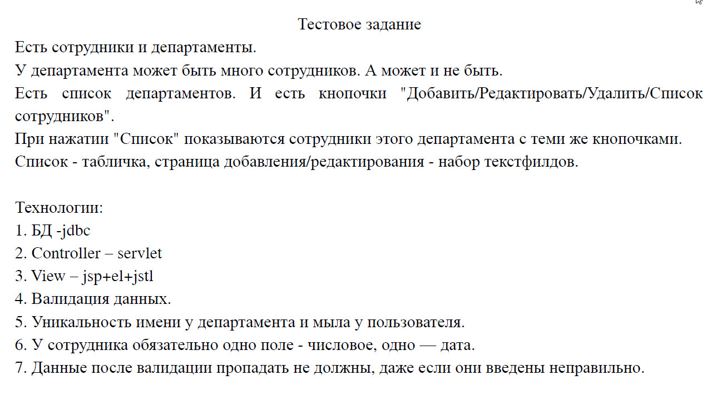

# Trainee Full Stack-Developer test task for Aimprosoft company

# Table of Contents
[Задача](#task_description) 
[Структура проекта](#structure) 
[Доступные функции](#avaiable_functions) 
[Валидация](#validation) 
[Для девелоперов](#developers_guide) 
[Конфигурация соеденения с базой данных](#configuration) 
[Разработчик](#developer)

# Задача

# Структура проекта

* Java 12
* JDBC
* Maven
* javax.servlet 4.0.1
* JSP
* JSTL 1.2
* maven-checkstyle-plugin 3.1.1
* mysql-connector-java 8.0.25
* org.junit.jupiter 5.8.0-M1
* org.hibernate.validator 6.0.10.Final
* javax.validation 2.0.1.Final

# Доступные функции
* Просмотр списка Департаментов

* Создание нового Департамента

* Редактирование существующего Департамента

* Просмотр всех сутрудников Департамента

* Просмотр статистики по Департаменту (данная функция не была указана в тестовом задании)

* Удаление департамента

* Создание нового Сотрудника

* Редактирование существующего Сотрудника

* Просмотр статистики по Сотруднику (данная функция не была указана в тестовом задании)

* Повышение сотрудника до Главы Департмента (данная функция не была указана в тестовом задании)

* Удаление сотрудника

# Валидация

Данный проект поддерживает валидацию входных данных в соответствии с описанием к заданию.
Валидация происходит на нескольких уровнях. 
Обратите внимание, невалидные данные в любом случае сохраняются на клиенте

(смотреть) [Database Scheme](src/main/resources/sql/database_scheme.sql)

* Для Департамента

Входные данные для Департамента валидируется на уровне сервиса по средствам javax.servlet Filter
(смотреть) [DepartmentFilter](src/main/java/filters/DepartmentFilter.java)

Так же имеется валидация на уровне базы данных

Правила валидации:
1. Title не может быть null
2. Title не может быть пустым
3. Минимальная длинна Title не должна быть короче 1 буквы
4. Максимальная длинна Title не должна быть больше 64 букв

5. Title может состоять только из латиници или кириллицы

6. Title - по умолчанию уникальный, это значит, что вы не сможете создать Департамент, title, которого уже существует в базе данных, то же правило действительно и для редактировния

7. Description может быть пустым или иметь до 255 любых символов

* Для Сотрудника

Входные данные для Сотрудника валидируется на уровне сервиса по средствам javax.servlet Filter

(смотреть) [EmployeeFilter](src/main/java/filters/EmployeeFilter.java)

Так же имеется валидация на уровне базы данных

Правила валидации:
1. First Name не может быть null
2. First Name не может быть пустым
3. Минимальная длинна First Name не должна быть короче 1 буквы
4. Максимальная длинна First Name не должна быть больше 32 букв

5. firstName может состоять только из латиници или кириллицы

6. Last Name не может быть null
7. Last Name не может быть пустым
8. Минимальная длинна Last Name не должна быть короче 1 буквы
9. Максимальная длинна Last Name не должна быть больше 32 букв

10. Last Name может состоять только из латиници или кириллицы

11. Email не может быть null
12. Email не может быть пустым

13. Email должен быть валидным

14. Email - по умолчанию уникальный, это значит, что вы не сможете создать Сотрудника, email, которого уже существует в базе данных, то же правило действительно и для редактировния

15. Salary Per Hour не может null

16. Salary Per Hour не может быть меньше 1 $

17. Salary Per Hour не может превышать число в 99999 $

18. Date Of Birth не может null

19. Date Of Birth не может быть в будущем

# Для девелоперов
Для успешного запуска проекта вам понадобится установить :

* Java 8+ (Рекомендую скачать JDK по этой ссылке https://openjdk.java.net/)
* Tomcat (Ссылка https://tomcat.apache.org/download-90.cgi)
* MySQL (Ссылка https://dev.mysql.com/downloads/installer/)

# Конфигурация соеденения с базой данных
(смотреть) [DatabaseConnectionConfig](src/main/resources/databaseConfig.properties)

# Разработчик

GitHub :octocat: [Michael Terletskyi](https://github.com/MichaelTerletskyi)